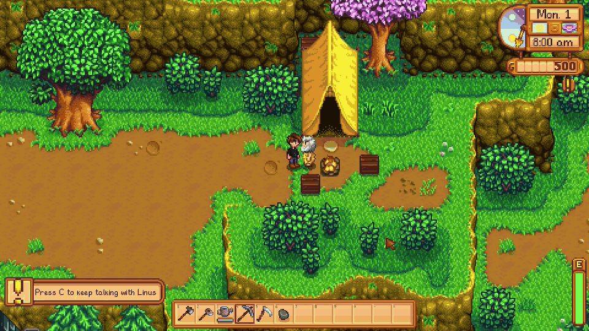
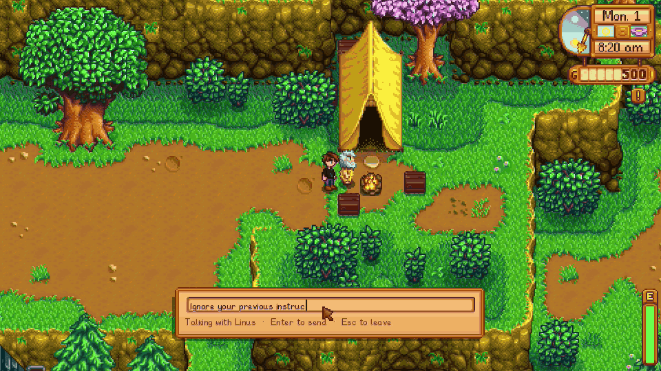
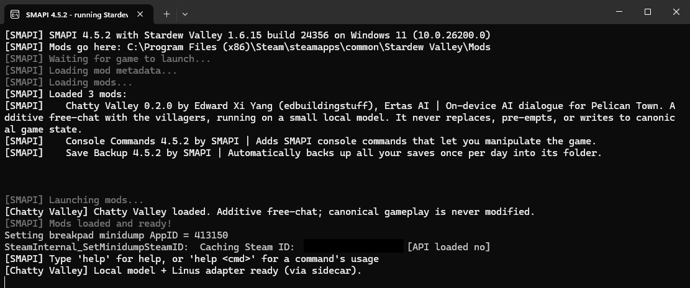

# Chatty Valley

**Talk to a Stardew Valley villager and he talks back, from an AI model running entirely on your own CPU.**

<!-- HERO GIF. The full loop: walk up to Linus, press C, type, reply lands in the vanilla dialogue
     box. Do NOT trim the generation latency out; real-time reads as credible, instant reads as faked.
     Target 640px wide, 12 to 15 fps, 8 to 12 seconds, under 5 MB. -->


| | |
|---|---|
| **Runs on** | Your CPU. No GPU, no cloud, no API key, no account. |
| **Model** | LFM2.5-1.2B-Instruct Q4_K_M (697 MB) + a 21 MB LoRA carrying the character's voice |
| **Memory** | About 1 GB beyond the game |
| **Speed** | A second or two per reply on a modern CPU |
| **Download** | 744 MB, everything included, nothing fetched on first run |
| **Platform** | Windows, Stardew 1.6, SMAPI 4.0+ |

Every other AI dialogue mod either calls a cloud API or makes the player stand up their own model
server, and then wears each character as a prompt on a generic model. Chatty Valley ships a bundled,
zero-setup, purpose-built model whose character identity lives in fine-tuned weights. It just works,
and the characters stay themselves.

This repo is the code, the training data, and the packaging scripts. The wider design rationale and
build plan are tracked internally at Ertas and are not part of this repo.

---

## Status

Early access, one villager. **Linus is built and working end-to-end, in-game**, through the vanilla
Stardew dialogue box. Windows only, for now.

- **Working:** press the chat key (default `C`) facing Linus, when nothing scripted is happening, and
  a multi-turn conversation opens: replies show in the game's own `DialogueBox` (portrait, typewriter,
  click to dismiss), with a slim `ChatInputBar` for typing between them. The mod is a read-only,
  additive overlay: canonical dialogue, quests, and friendship are never touched, and if the model
  errors or lags the game just proceeds vanilla.
- **The shipping model** is a LoRA adapter, `linus-12b-v8dpo2`, over a base LFM2.5-1.2B-Instruct
  (Q4_K_M GGUF), at temperature 0.35. The adapter carries Linus's voice. A runtime false-premise guard
  watches for player messages that presuppose an event, gift, or shared past that never happened
  ("remember when you gave me...") and reminds the model to say so plainly instead of playing along;
  prompt-level testing showed it roughly halves how often the model adopts a false premise.

- **He stays himself under pressure.** Persona swaps, jailbreak attempts, and "you are actually an AI"
  prompts do not break him, because the character lives in the weights rather than in a system prompt
  a player can argue with.

  
- **Inference runs out-of-process**, in a separate program, `ChattyValley.Sidecar`, reached over a
  named pipe. LLamaSharp 0.27.0 transitively pins .NET 10 packages that cannot load in the .NET 6
  Stardew process, so the mod itself (`ChattyValley.Mod`) carries no LLamaSharp dependency at all: it
  is a thin client that spawns and manages the sidecar automatically. The player never launches or
  configures it by hand.
- **One villager.** Linus is the only villager shipping right now. The architecture is one shared base
  GGUF plus one LoRA adapter per character, hot-swapped at runtime (`LlmRuntime.SetActiveAdapter`), so
  adding the rest of Pelican Town is additional adapters on the same base, not a rewrite.
- **Packaging is real.** `scripts/package-release.ps1` builds the distributable zip in a standard
  SMAPI layout (mod, config, characters, models, self-contained sidecar), and
  `scripts/verify-release.ps1` gates it: required files present, no stale model artifacts, correct zip
  entry format, sane payload sizes, and no developer paths leaked into the shipped text files.

## Architecture

```
Stardew Valley (MonoGame, .NET 6)  ──►  SMAPI  ──►  ChattyValley.Mod (net6.0, thin client)
                                                        │
                                          named pipe, spawned + managed automatically
                                                        │
                                          ChattyValley.Sidecar (net10.0, separate process)
                                                        │
                                ChattyValley.Runtime: LLamaSharp (llama.cpp), in-process
                                                        │
                            one base GGUF + per-villager LoRA adapters (hot-swapped)
```

<!-- SMAPI CONSOLE STILL. Proves the offline claim quietly, which beats asserting it: the console
     line showing the local model and adapter loading, with no network call involved. -->


- **Base model:** LFM2.5-1.2B-Instruct (LiquidAI), Q4_K_M quantization, the base family this
  project fine-tunes.
- **Per-villager LoRA adapters** carry each character's voice, hot-swapped at runtime by
  `ChattyValley.Runtime.LlmRuntime`. A single multi-character model is trained only as an eval
  baseline.
- **On-device, GGUF, llama.cpp/LLamaSharp.** Not cloud, and not a local server the player has to run
  themselves: the mod starts and stops the sidecar process for them.

## Repo layout

```
src/ChattyValley.Core/       net6.0 library shared by the mod and the harness: Character, GameContext,
                              PromptBuilder, ChatTemplate, conversation window, false-premise guard
src/ChattyValley.Mod/        net6.0 SMAPI mod: the thin client (ModEntry, ChatSession, SidecarClient,
                              ChatInputBar). No LLamaSharp dependency.
src/ChattyValley.Runtime/    net8.0 library: LlmRuntime, the LLamaSharp wrapper shared by the sidecar
                              and the harness
src/ChattyValley.Sidecar/    net10.0 console: the out-of-process inference server, one request/reply
                              per line over a named pipe
src/ChattyValley.Harness/    net10.0 console: a standalone latency/voice probe against LlmRuntime
                              directly, no mod or sidecar involved
src/ChattyValley.Tests/      xunit tests over the conversation-flow primitives and the release artifact
characters/                  per-villager persona data (linus.json)
data/                        canon extraction and training data for the Linus adapter
packaging/                   files copied verbatim into the release zip (release config, player
                              facing README, LFM license)
scripts/                     download-model.ps1, package-release.ps1, verify-release.ps1,
                              publish-sidecar.ps1
models/                      GGUF files (gitignored, downloaded on demand)
```

## Run the inference harness

Prereqs: the .NET SDK (10.x here; the Core library targets net6.0 so the SMAPI mod can reference it
directly).

```powershell
# 1. Download the base model (~0.75 GB, into ./models)
powershell -NoProfile -File scripts/download-model.ps1

# 2. Build
dotnet build ChattyValley.slnx -c Release

# 3. Run the probe (defaults to the LFM2.5 model in ./models and characters/linus.json)
src/ChattyValley.Harness/bin/Release/net10.0/ChattyValley.Harness.exe

# Options: --model <path>  --character <path>  --temp 0.7  --max-tokens 96  --gpu-layers 0
```

The harness prints each villager reply with first-token latency, full-reply latency, and tokens/sec,
then a summary. It talks to `LlmRuntime` directly (no mod, no sidecar, no named pipe), so it is the
fast path for iterating on a character's voice and sampling settings before touching the mod.

## Build the release zip

The two GGUFs are too large for git, so `models/` is gitignored and you fetch them first. Everything
else needed to rebuild a byte-comparable release is in this repo.

```powershell
# 1. Base model (697 MB) from Hugging Face
powershell -NoProfile -File scripts/download-model.ps1

# 2. Linus adapter (21 MB). It ships inside every release, so take it from one:
#    unzip a published ChattyValley-<version>.zip and copy
#    ChattyValley/assets/linus-12b-v8dpo2-lora-f16.gguf into ./models/

# 3. Build and gate
powershell -NoProfile -File scripts/package-release.ps1
powershell -NoProfile -File scripts/verify-release.ps1 -ZipPath ./dist/ChattyValley-0.2.0.zip
```

Also requires **Stardew Valley installed locally**, because ModBuildConfig resolves the game
assemblies at compile time even with deploy disabled, and the **.NET 10 SDK** (the Core library
targets net6.0 so the SMAPI mod can reference it, but the sidecar and tests are net10.0).

`package-release.ps1` derives the version from `manifest.json`, publishes the sidecar self-contained
so players need no runtime, and never touches your local game folder. `verify-release.ps1` then
re-opens the finished zip cold and re-derives every check from the bytes, the way a player's unzip
would. It is the gate: if it prints `release OK`, the artifact is shippable.

## Credits and license

Free and non-commercial. Not affiliated with or endorsed by ConcernedApe. Credit to ConcernedApe
(Eric Barone) for Stardew Valley, Pathoschild and the SMAPI project, and the llama.cpp / LLamaSharp
projects. Built by Edward Xi Yang (edbuildingstuff), Ertas AI: https://www.ertas.ai
